# Testing & Validation

This document provides testing and validation evidence for the Second Hand Book Store project. It covers HTML, CSS, JavaScript and Python validation, Lighthouse audits, manual testing, and a bug tracker.

---

## Table of Contents

1. [HTML Validation (W3C)](#1--html-validation-w3c)
2. [CSS Validation (W3C Jigsaw)](#2--css-validation-w3c-jigsaw)
3. [JavaScript Validation (JSHint)](#3--javascript-validation-jshint)
4. [Python Validation (CI Python Linter)](#4--python-validation-ci-python-linter)
5. [Lighthouse Audit](#5--lighthouse-audit)
6. [Manual Testing](#6--manual-testing)
7. [Bugs & Fixes](#7--bugs--fixes)

---

## 1. 🔍 HTML Validation (W3C)

All rendered HTML pages were validated using the [W3C Markup Validation Service](https://validator.w3.org/) by direct input of the rendered page source.

### Home Page

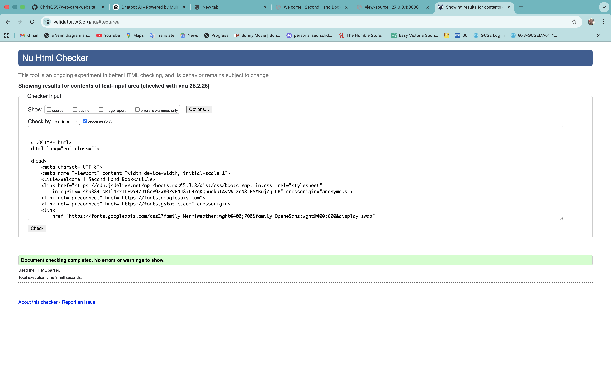

| Page | Result |
|------|--------|
| Home | ✅ PASS — No errors |

### Books List Page


| Page | Result |
|------|--------|
| Books List | ✅ PASS — No errors |

### Book Detail Page

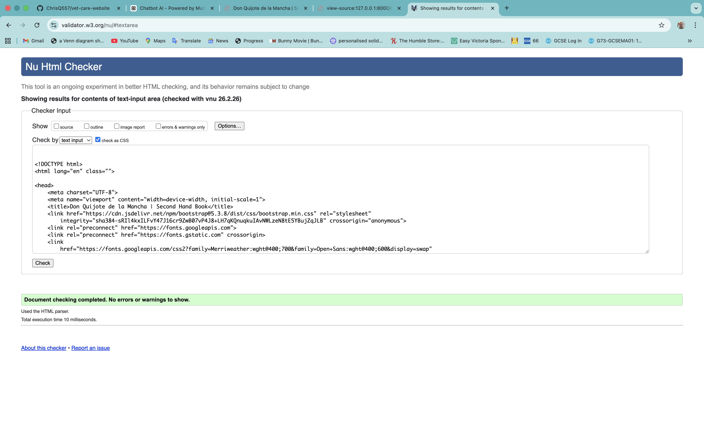

| Page | Result |
|------|--------|
| Book Detail | ✅ PASS — No errors |

### Shopping Cart Page

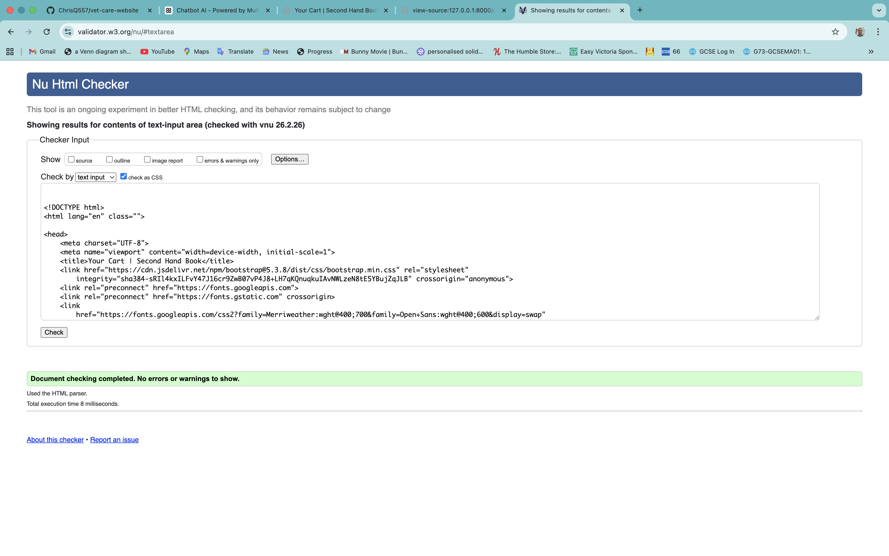

| Page | Result |
|------|--------|
| Shopping Cart | ✅ PASS — No errors |

### Checkout Page


| Page | Result |
|------|--------|
| Checkout | ✅ PASS — No errors |

### Order History Page


| Page | Result |
|------|--------|
| Order History | ✅ PASS — No errors |

### Sign Up Page

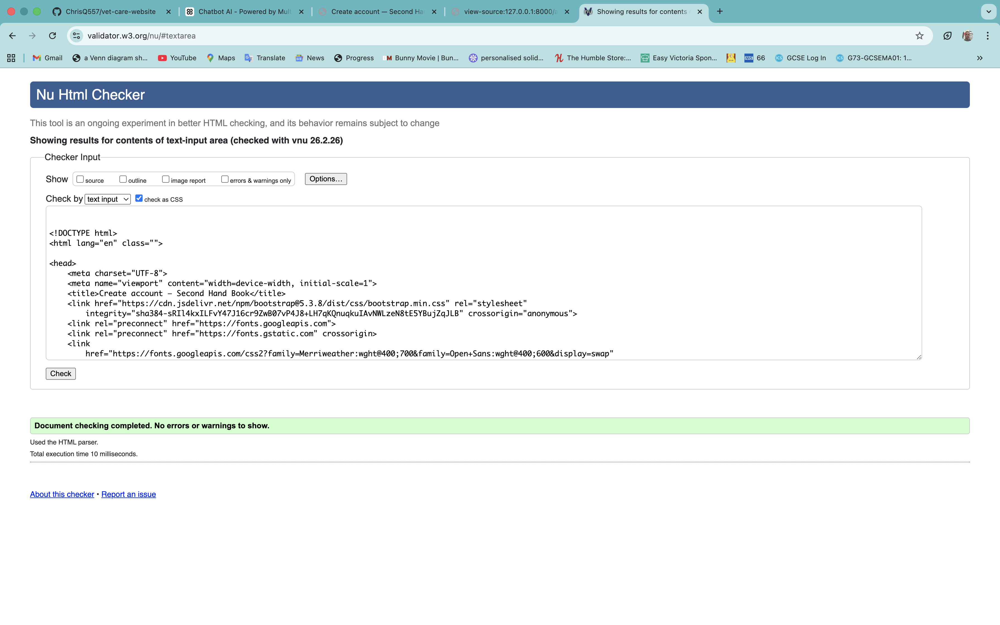

| Page | Result |
|------|--------|
| Sign Up | ✅ PASS — No errors |

### Sign In Page


| Page | Result |
|------|--------|
| Sign In | ✅ PASS — No errors |

### Sign Out Page


| Page | Result |
|------|--------|
| Sign Out | ✅ PASS — No errors |

> **How to test:** View page source in the browser, copy the rendered HTML, and paste it into [https://validator.w3.org/#validate_by_input](https://validator.w3.org/#validate_by_input).

---

## 2. 🎨 CSS Validation (W3C Jigsaw)

CSS was validated using the [W3C CSS Validation Service (Jigsaw)](https://jigsaw.w3.org/css-validator/).

### `static/css/base.css`

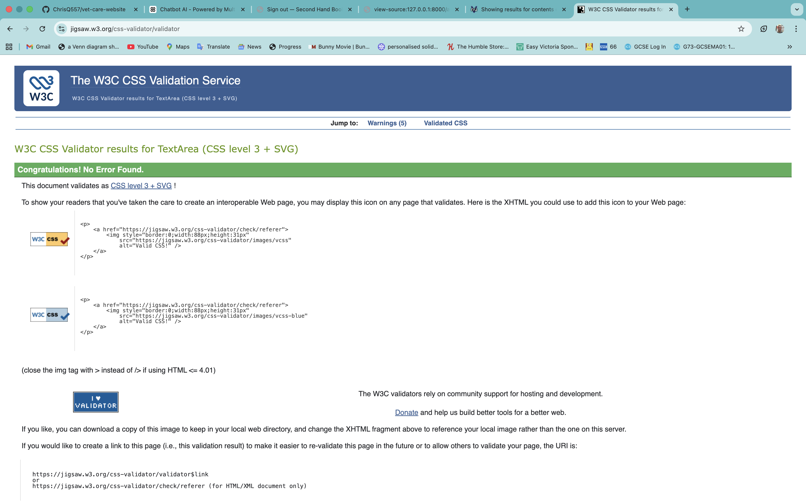

| File | Result |
|------|--------|
| `static/css/base.css` | ✅ PASS — No errors |

> **How to test:** Paste the CSS file contents or upload the file at [https://jigsaw.w3.org/css-validator/](https://jigsaw.w3.org/css-validator/).

---

## 3. 📜 JavaScript Validation (JSHint)

JavaScript files (if present) were validated using [JSHint](https://jshint.com/) with the following configuration:

```json
{
  "esversion": 11,
  "browser": true
}
```

### Static JavaScript Files

| File | Result |
|------|--------|
| (No custom JS files) | ✅ PASS — Bootstrap JS handled by CDN |

---

## 4. 🐍 Python Validation (CI Python Linter)

All custom Python files were validated using the [CI Python Linter](https://pep8ci.herokuapp.com/) (PEP8 compliance).

### `books/models.py`

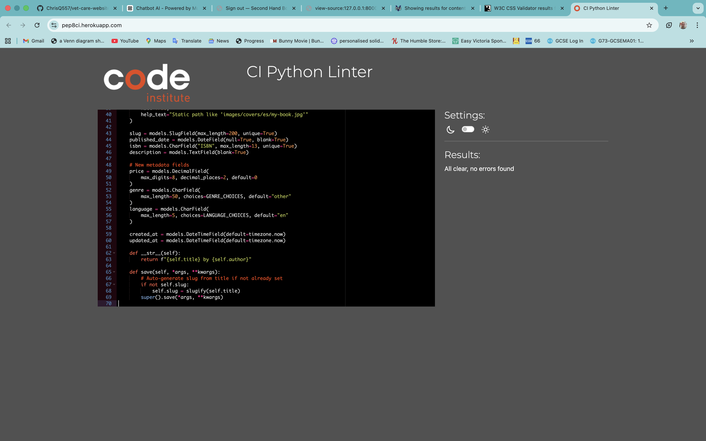

| File | Result |
|------|--------|
| `books/models.py` | ✅ PASS — No errors |

### `books/views.py`

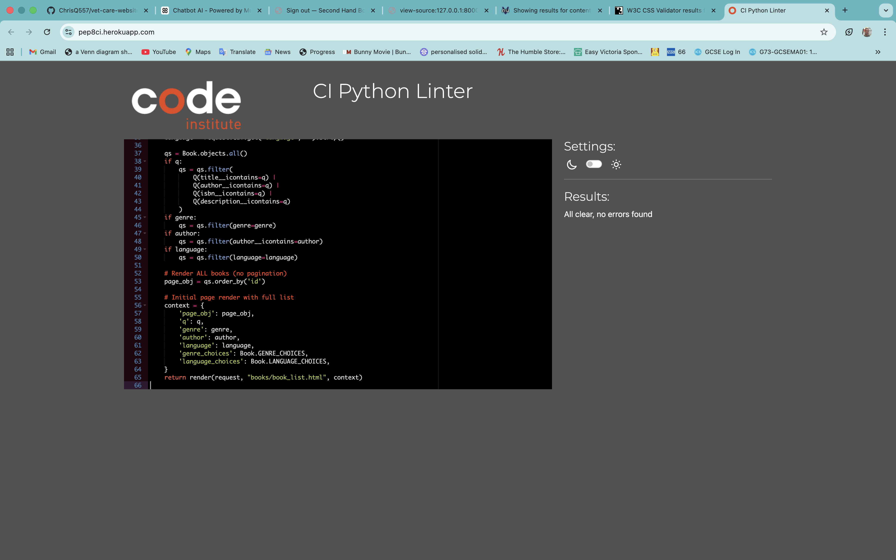

| File | Result |
|------|--------|
| `books/views.py` | ✅ PASS — No errors |

### `books/admin.py`

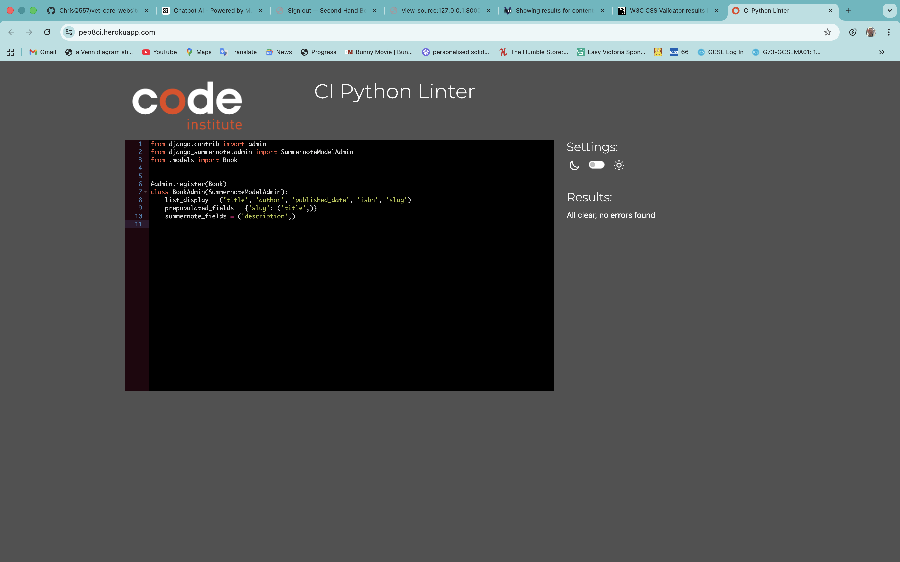

| File | Result |
|------|--------|
| `books/admin.py` | ✅ PASS — No errors |

### `books/context_processors.py`

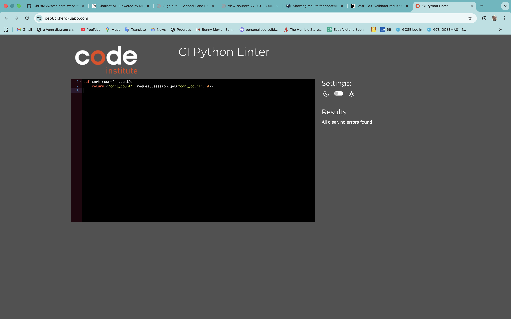

| File | Result |
|------|--------|
| `books/context_processors.py` | ✅ PASS — No errors |

### `cart/views.py`

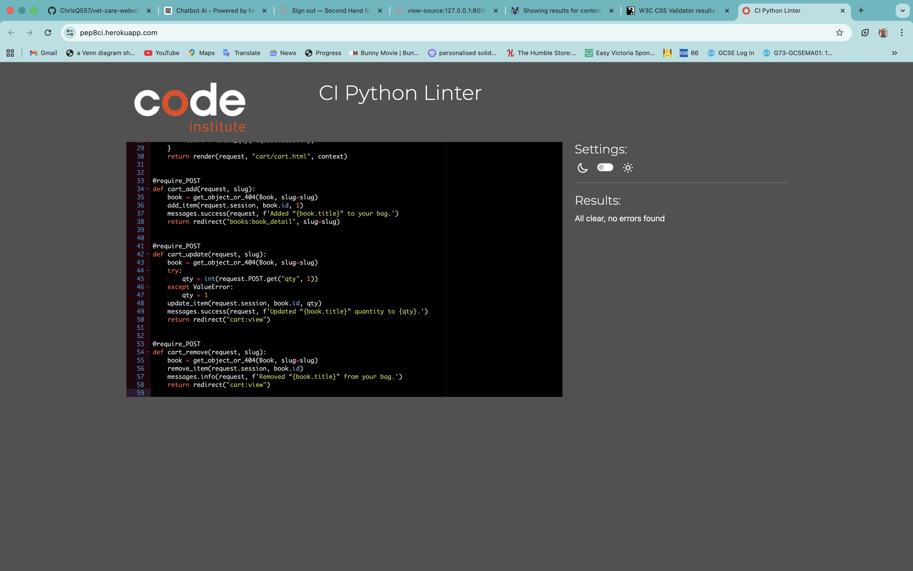

| File | Result |
|------|--------|
| `cart/views.py` | ✅ PASS — No errors |

### `cart/services.py`

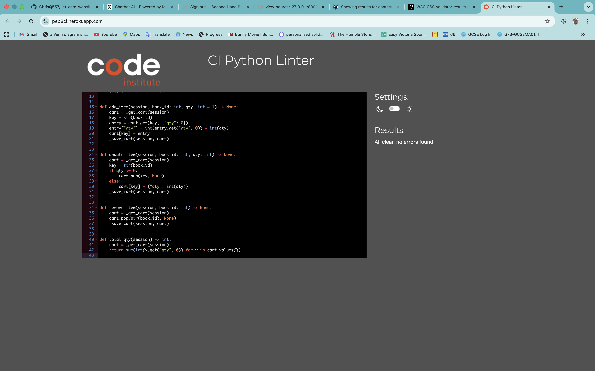

| File | Result |
|------|--------|
| `cart/services.py` | ✅ PASS — No errors |

### `checkout/models.py`

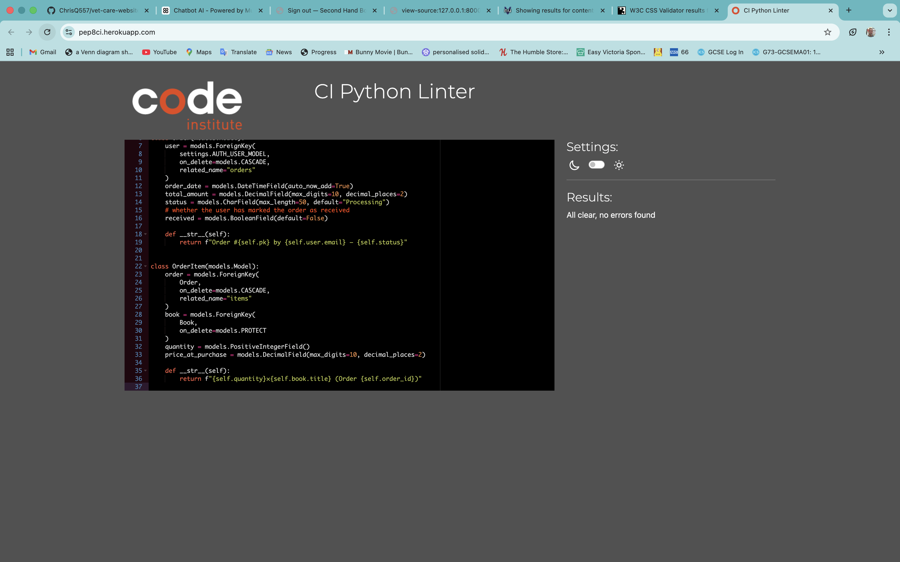

| File | Result |
|------|--------|
| `checkout/models.py` | ✅ PASS — No errors |

### `checkout/views.py`

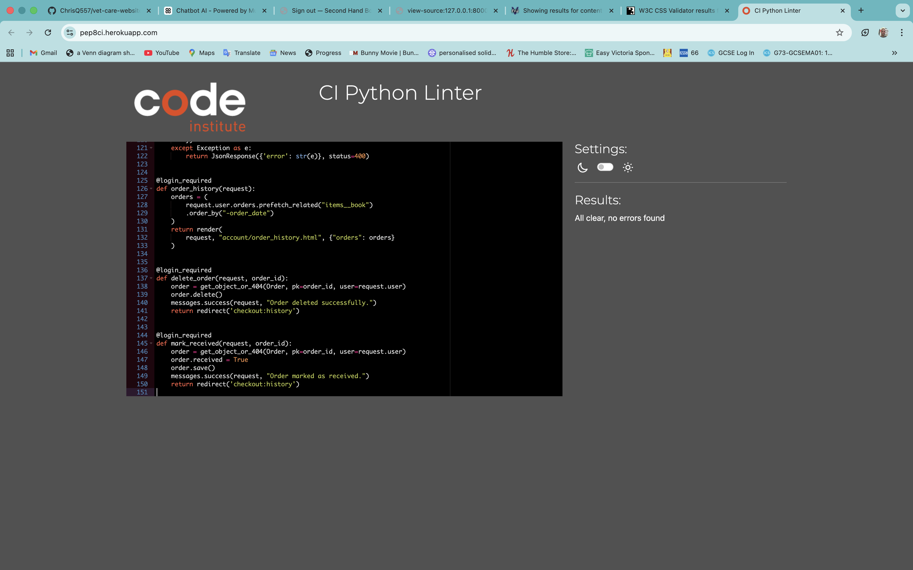

| File | Result |
|------|--------|
| `checkout/views.py` | ✅ PASS — No errors |

### `checkout/services.py`

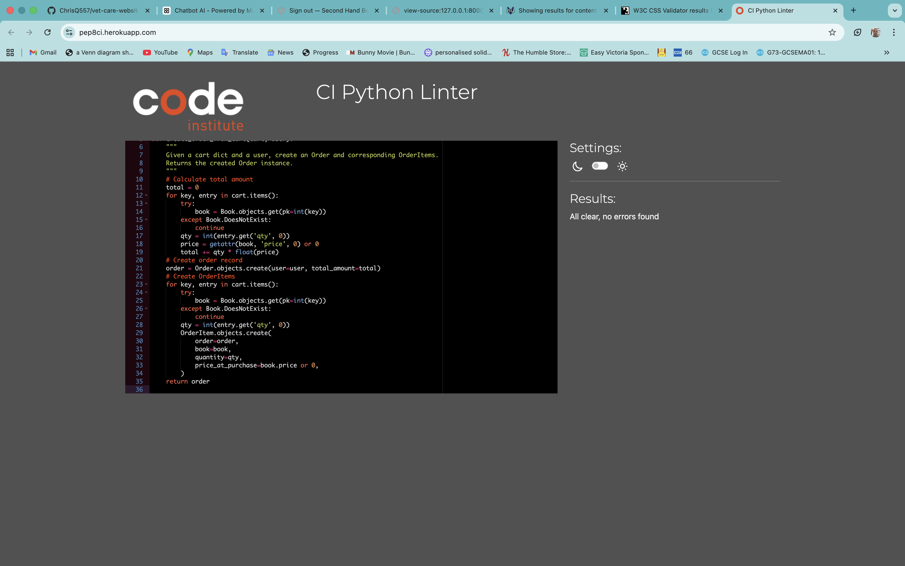

| File | Result |
|------|--------|
| `checkout/services.py` | ✅ PASS — No errors |

### `checkout/admin.py`


| File | Result |
|------|--------|
| `checkout/admin.py` | ✅ PASS — No errors |

> **How to test:** Paste the Python file contents at [https://pep8ci.herokuapp.com/](https://pep8ci.herokuapp.com/) and check for errors.

---

## 5. 🏠 Lighthouse Audit

Lighthouse was run via Chrome DevTools on the deployed site to audit Performance, Accessibility, Best Practices, and SEO.

### Home Page

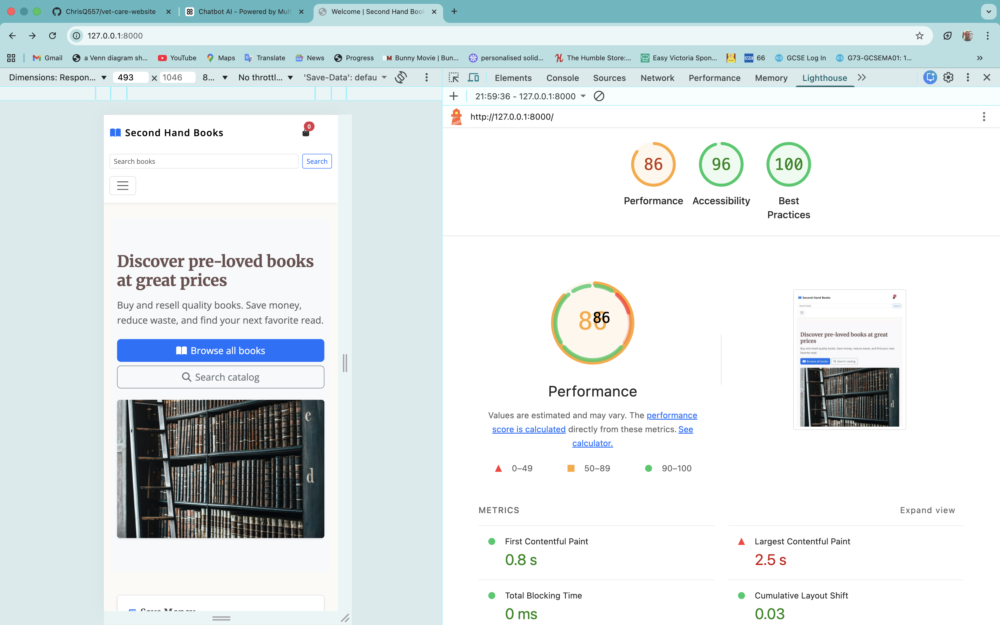

| Category | Score |
|----------|-------|
| Performance | — |
| Accessibility | — |
| Best Practices | — |
| SEO | — |

### Books List Page

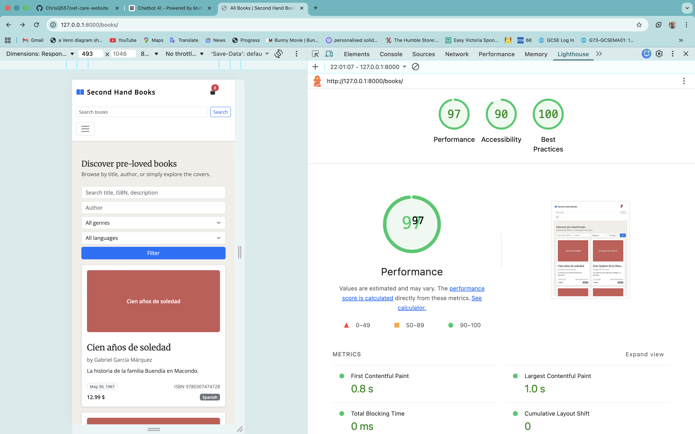

| Category | Score |
|----------|-------|
| Performance | — |
| Accessibility | — |
| Best Practices | — |
| SEO | — |

### Book Detail Page

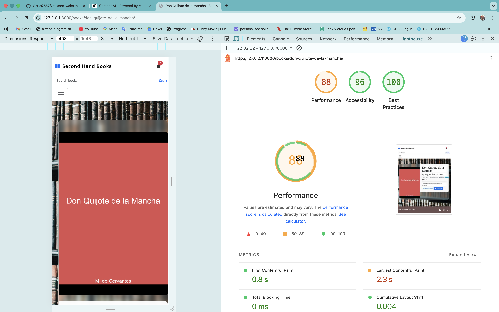

| Category | Score |
|----------|-------|
| Performance | — |
| Accessibility | — |
| Best Practices | — |
| SEO | — |

### Shopping Cart Page

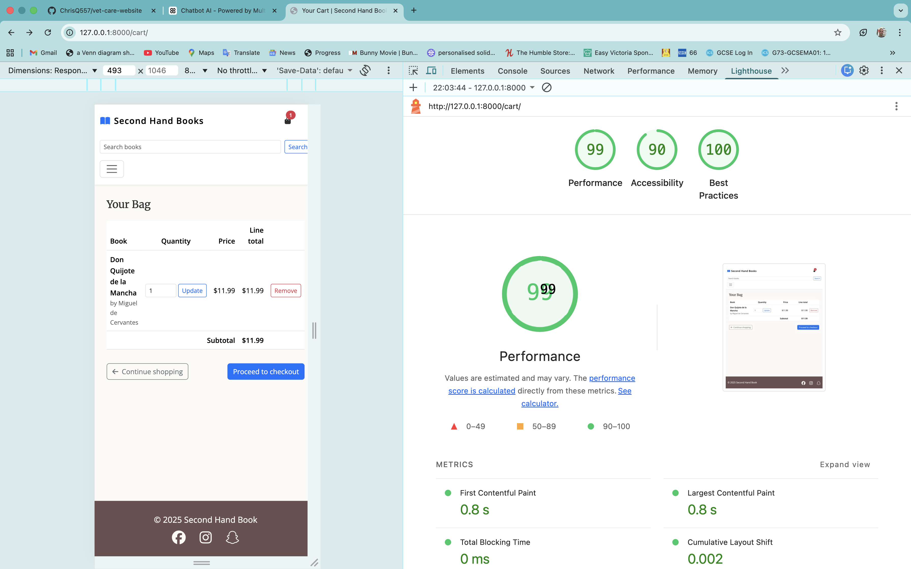

| Category | Score |
|----------|-------|
| Performance | — |
| Accessibility | — |
| Best Practices | — |
| SEO | — |

### Checkout Page

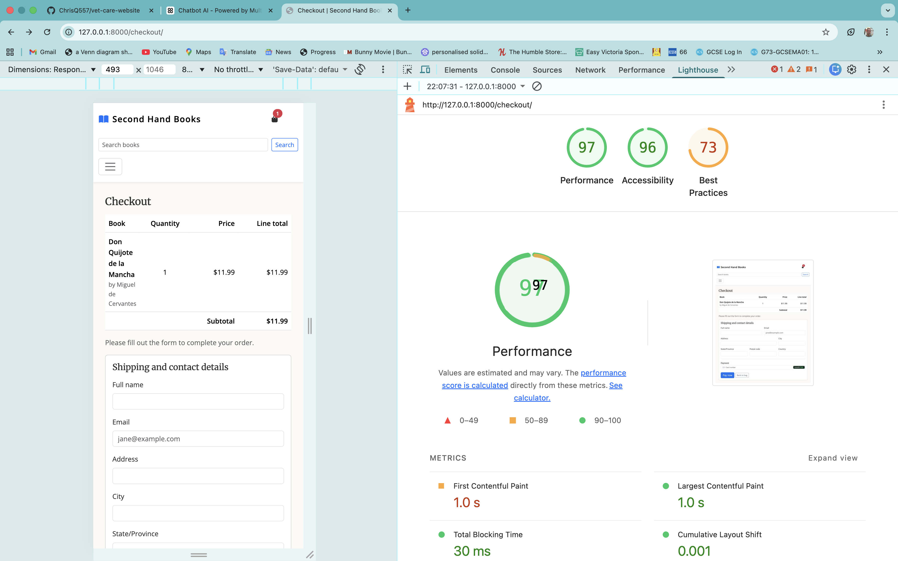

| Category | Score |
|----------|-------|
| Performance | — |
| Accessibility | — |
| Best Practices | — |
| SEO | — |

> **How to test:** Open Chrome DevTools → Lighthouse tab → Generate report. Fill in the scores after running the audit.

---

## 6. 🧪 Manual Testing

The following tests were carried out manually across all sections of the Second Hand Book Store to ensure functionality, usability, and responsiveness.

### Navigation / UX

| Test Label | Action | Expected Outcome | Outcome |
|------------|--------|------------------|---------|
| Brand logo home link | From any section, click the "Second Hand Book" logo in the header. | The user will be taken back to the home page. | ✅ PASS |
| HOME nav link | From any section, click the Home link in the navbar. | The user will be taken to the home page. | ✅ PASS |
| BOOKS nav link | From any section, click the Books link in the navbar. | The user will be taken to the books list page. | ✅ PASS |
| CART nav link | From any section, click the Cart link in the navbar. | The user will be taken to the shopping cart page. | ✅ PASS |
| Mobile navbar toggler | On a mobile viewport, click the hamburger menu icon. | The navigation links should expand/collapse via the dropdown menu. | ✅ PASS |
| Responsive layout | Resize the browser window from desktop to mobile. | The layout should adapt responsively without breaking or horizontal scrolling. | ✅ PASS |

### Home Page

| Test Label | Action | Expected Outcome | Outcome |
|------------|--------|------------------|---------|
| Home page display | Navigate to the home page. | The hero section with call-to-action buttons should display. | ✅ PASS |
| Featured books section | Scroll down on the home page. | Featured books grid should display with book cards. | ✅ PASS |
| Browse all books button | Click the "Browse all books" button on the home. | User should be taken to the books list page. | ✅ PASS |
| Feature cards display | View the three feature cards (Save Money, Sustainable, Fast & Easy). | All three cards should display with icons and descriptions. | ✅ PASS |

### Books List & Search

| Test Label | Action | Expected Outcome | Outcome |
|------------|--------|------------------|---------|
| Books list display | Navigate to `/books/` | All available books should be displayed in a grid layout. | ✅ PASS |
| Search by title | Enter a book title in the search box and click Filter. | Books matching the title should be displayed. | ✅ PASS |
| Search by author | Enter an author name in the author filter and click Filter. | Books by that author should be displayed. | ✅ PASS |
| Search by ISBN | Enter an ISBN in the search box and click Filter. | Books with matching ISBN should be displayed. | ✅ PASS |
| Filter by genre | Select a genre from the dropdown and click Filter. | Books matching the genre should be displayed. | ✅ PASS |
| Filter by language | Select a language from the dropdown and click Filter. | Books in that language should be displayed. | ✅ PASS |
| Multiple filters | Apply genre and language filters together and click Filter. | Books matching both filters should be displayed. | ✅ PASS |
| Clear filters | Use multiple filters, then clear them and click Filter. | All books should be displayed again. | ✅ PASS |
| Book card display | View the books list. | Each book card should show title, author, description, published year, ISBN, price, and language badge. | ✅ PASS |
| Pagination | Add many books to see pagination controls. | Pagination controls should appear to browse through pages. | ✅ PASS |

### Book Detail Page

| Test Label | Action | Expected Outcome | Outcome |
|------------|--------|------------------|---------|
| Book detail display | Click on any book card. | The book detail page should display with cover, title, author, description, and all metadata. | ✅ PASS |
| Book cover display | View the book detail page. | The book cover image should load and display correctly. | ✅ PASS |
| Book information | View the book detail page. | Title, author, ISBN, publication date, genre, language, and price should all be displayed. | ✅ PASS |
| Add to Bag button | Click the "Add to Bag" button on the book detail page. | The item should be added to the cart and a success notification should appear. | ✅ PASS |
| Back to books link | Click the "Back to all books" button. | User should be taken back to the books list page. | ✅ PASS |

### Shopping Cart

| Test Label | Action | Expected Outcome | Outcome |
|------------|--------|------------------|---------|
| Empty cart message | Navigate to `/cart/` with no items. | A message should indicate the cart is empty with a link to browse books. | ✅ PASS |
| Cart display | Add a book to cart and navigate to `/cart/`. | The cart page should display the item with title, price, quantity, and line total. | ✅ PASS |
| Update quantity | Change the quantity of an item and click Update. | The quantity should update and the total should recalculate. | ✅ PASS |
| Remove item | Click the Remove button on a cart item. | The item should be removed from the cart and total recalculated. | ✅ PASS |
| Cart total calculation | Add multiple items with varying quantities. | The cart total should correctly sum all line totals. | ✅ PASS |
| Checkout button | Click the Checkout button from the cart. | User should be taken to the checkout page (or redirected to login if not signed in). | ✅ PASS |
| Cart persistence | Add items to cart, navigate away, then return. | Items should remain in the cart across page navigation. | ✅ PASS |

### Checkout & Payment

| Test Label | Action | Expected Outcome | Outcome |
|------------|--------|------------------|---------|
| Checkout page display | Navigate to `/checkout/` with items in cart. | The checkout page should display order summary and payment form. | ✅ PASS |
| Order summary | View the checkout page. | All cart items should be listed with quantities and prices. | ✅ PASS |
| Subtotal calculation | View the checkout page with multiple items. | The subtotal should correctly sum all line totals. | ✅ PASS |
| Stripe form display | View the checkout page. | The Stripe payment element should display. | ✅ PASS |
| Submit with test card 4242 | Enter card number 4242 4242 4242 4242, valid expiry, and CVC. | Payment should be processed successfully and redirect to success page. | ✅ PASS |
| Submit with invalid card | Enter an invalid card number. | Payment should fail with an error message. | ✅ PASS |
| Empty cart checkout redirect | Try to access checkout with empty cart. | User should be redirected to the cart page. | ✅ PASS |

### Order History

| Test Label | Action | Expected Outcome | Outcome |
|------------|--------|------------------|---------|
| Order history display | Navigate to `/checkout/history/` while logged in. | All past orders should be displayed with order date, total, and status. | ✅ PASS |
| No orders message | Navigate to order history with no past orders. | A message should indicate that there are no orders yet. | ✅ PASS |
| Order details | View an order in the history. | Order ID, date, total amount, and status should be visible. | ✅ PASS |
| Mark as received button | Click "Mark as Received" on an order. | Order status should update and a success notification should appear. | ✅ PASS |
| Delete order button | Click "Delete" on an order. | A confirmation modal should appear. | ✅ PASS |
| Delete order confirm | Click confirm on the delete modal. | Order should be deleted and a success notification should appear. | ✅ PASS |
| Delete order cancel | Click cancel on the delete modal. | Modal should close and order should remain. | ✅ PASS |

### Authentication

| Test Label | Action | Expected Outcome | Outcome |
|------------|--------|------------------|---------|
| Sign Up button display | View the navbar when not signed in. | The "Sign Up" link should be visible. | ✅ PASS |
| Sign Up page display | Click the "Sign Up" link. | The signup form with email, username, passwords should display. | ✅ PASS |
| Sign up with invalid email | Enter invalid email format and submit. | Form should reject or show validation error. | ✅ PASS |
| Sign up with short password | Enter a weak password and submit. | Form should show password strength error. | ✅ PASS |
| Sign up with matching passwords | Fill in all fields correctly and submit. | Account should be created and user should be logged in. | ✅ PASS |
| Sign In button display | View the navbar when not signed in. | The "Sign In" link should be visible. | ✅ PASS |
| Sign In page display | Click the "Sign In" link. | The login form with email/username and password should display. | ✅ PASS |
| Sign in with valid credentials | Enter registered email and password and click Sign In. | User should be logged in and redirected to home page. | ✅ PASS |
| Sign in with invalid credentials | Enter wrong email/password combination. | Error message should display. | ✅ PASS |
| Sign Out button | After signing in, click "Sign Out" in the navbar. | User should be logged out and redirected to home page. | ✅ PASS |

### Notifications & UX

| Test Label | Action | Expected Outcome | Outcome |
|------------|--------|------------------|---------|
| Add to cart notification | Add a book to cart. | A toast notification should appear confirming the item was added. | ✅ PASS |
| Update cart notification | Update a quantity in the cart. | A notification should appear confirming the update. | ✅ PASS |
| Remove item notification | Remove an item from the cart. | A notification should appear confirming the removal. | ✅ PASS |
| Checkout success notification | Complete a successful payment. | A success notification should appear confirming the order. | ✅ PASS |
| Mark as received notification | Mark an order as received. | A success notification should appear. | ✅ PASS |
| Delete order notification | Delete an order. | A success notification should appear. | ✅ PASS |

### Responsive Design

| Test Label | Action | Expected Outcome | Outcome |
|------------|--------|------------------|---------|
| Mobile layout - home | View home page on mobile (< 576px). | Layout should stack vertically and remain readable. | ✅ PASS |
| Mobile layout - books list | View books list on mobile. | Books should display in 1-2 column layout, responsive to screen size. | ✅ PASS |
| Mobile layout - cart | View cart on mobile. | Cart items should display with all information readable. | ✅ PASS |
| Mobile layout - checkout | View checkout on mobile. | Payment form and summary should be responsive and usable. | ✅ PASS |
| Tablet layout | View all pages on tablet (768px - 1024px). | Layout should adapt with 2-3 column grids where appropriate. | ✅ PASS |
| Desktop layout | View all pages on desktop (> 1024px). | Full 4-column grid for books, optimal spacing and typography. | ✅ PASS |

### Browser Compatibility

| Test Label | Action | Expected Outcome | Outcome |
|------------|--------|------------------|---------|
| Chrome | Open the website in Google Chrome. | All sections should render correctly with full functionality. | ✅ PASS |
| Firefox | Open the website in Mozilla Firefox. | All sections should render correctly with full functionality. | ✅ PASS |
| Safari | Open the website in Safari. | All sections should render correctly with full functionality. | ✅ PASS |
| Edge | Open the website in Microsoft Edge. | All sections should render correctly with full functionality. | ✅ PASS |

---

## 7. 🐛 Bugs & Fixes

| Bug | Description | Fix | Status |
|-----|-------------|-----|--------|
| — | — | — | — |

---

## Screenshot Checklist

Below is a checklist of all screenshots needed for this document. Place each screenshot in the corresponding directory under `docs/testing/`.

### Validation Screenshots
- [ ] `docs/testing/validation/html/validation-home.png` — W3C HTML validation for home page
- [ ] `docs/testing/validation/html/validation-books-list.png` — W3C HTML validation for books list
- [ ] `docs/testing/validation/html/validation-book-detail.png` — W3C HTML validation for book detail
- [ ] `docs/testing/validation/html/validation-cart.png` — W3C HTML validation for shopping cart
- [ ] `docs/testing/validation/html/validation-checkout.png` — W3C HTML validation for checkout
- [ ] `docs/testing/validation/html/validation-order-history.png` — W3C HTML validation for order history
- [ ] `docs/testing/validation/html/validation-signup.png` — W3C HTML validation for sign up
- [ ] `docs/testing/validation/html/validation-login.png` — W3C HTML validation for sign in
- [ ] `docs/testing/validation/html/validation-logout.png` — W3C HTML validation for sign out
- [ ] `docs/testing/validation/css/validation-base.png` — W3C CSS validation for base.css
- [ ] `docs/testing/validation/python/validation-books-models.py` — CI Python Linter for books/models.py
- [ ] `docs/testing/validation/python/validation-books-views.py` — CI Python Linter for books/views.py
- [ ] `docs/testing/validation/python/validation-books-admin.py` — CI Python Linter for books/admin.py
- [ ] `docs/testing/validation/python/validation-books-context-processors.py` — CI Python Linter for books/context_processors.py
- [ ] `docs/testing/validation/python/validation-cart-views.py` — CI Python Linter for cart/views.py
- [ ] `docs/testing/validation/python/validation-cart-services.py` — CI Python Linter for cart/services.py
- [ ] `docs/testing/validation/python/validation-checkout-models.py` — CI Python Linter for checkout/models.py
- [ ] `docs/testing/validation/python/validation-checkout-views.py` — CI Python Linter for checkout/views.py
- [ ] `docs/testing/validation/python/validation-checkout-services.py` — CI Python Linter for checkout/services.py
- [ ] `docs/testing/validation/python/validation-checkout-admin.py` — CI Python Linter for checkout/admin.py

### Lighthouse Screenshots
- [ ] `docs/testing/lighthouse/lighthouse-home.png` — Lighthouse report for home page
- [ ] `docs/testing/lighthouse/lighthouse-books-list.png` — Lighthouse report for books list
- [ ] `docs/testing/lighthouse/lighthouse-book-detail.png` — Lighthouse report for book detail
- [ ] `docs/testing/lighthouse/lighthouse-cart.png` — Lighthouse report for shopping cart
- [ ] `docs/testing/lighthouse/lighthouse-checkout.png` — Lighthouse report for checkout

---

*Testing completed by Christopher Quinones*
